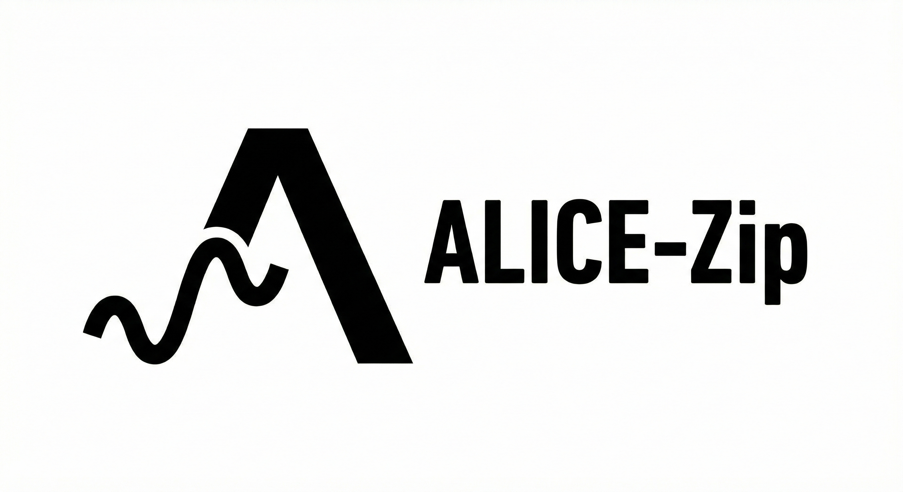

<p align="center">
  
</p>

<h1 align="center">ALICE-Zip</h1>

<p align="center">
  <a href="https://crates.io/crates/alice-zip"></a>
  <a href="https://docs.rs/alice-zip"></a>
  <a href="https://github.com/ext-sakamoro/ALICE-Zip/actions/workflows/ci.yml"></a>
  <a href="https://github.com/ext-sakamoro/ALICE-Zip/actions/workflows/security-audit.yml"></a>
  <a href="https://github.com/ext-sakamoro/ALICE-Zip/actions/workflows/fuzz.yml"></a>
  <a href="#license"></a>
  <a href="https://python.org"></a>
</p>

> **Procedural Generation Compression Engine**
> *Store algorithms, not data.*

[日本語版 README](README_ja.md)

---

ALICE-Zip is a next-generation compression tool that stores **"how to generate the data"** instead of the data itself.

For patterns, waves, and mathematical data, it achieves compression ratios of **10x to 1000x**.
For everything else, it falls back to LZMA, ensuring it's **never worse** than standard tools.

## Features

- **Procedural Compression:** Sine waves, polynomials, and mathematical patterns
- **Adaptive Fallback:** Automatically selects LZMA when procedural methods don't help
- **Lossless:** Bit-perfect reconstruction
- **Cross-Platform:** Python, Rust, C#/Unity, C++/UE5

## Repository layout

| Path | What | Where it ships |
|------|------|----------------|
| `/` (`alice-zip`) | **Rust core crate** — compression primitives (LZ77, dictionary, BPE, entropy, quantisation, zlib / LZMA residual containers) + every generator law (polynomial / Fourier / Perlin), `no_std + alloc` | [crates.io](https://crates.io/crates/alice-zip) · [docs.rs](https://docs.rs/alice-zip) |
| `libalice/` (`alice-zip-cli`) | CLI `alice`, C FFI (`cdylib`), PyO3 native module; thin re-export of the core generators and compression | C# / UE5 bindings, pip `libalice` |
| `alice_zip/` | Python package (`ALICEZip` analyzer + `.alice` container) | pip `alice-zip` |
| `bindings/` | C++ / C# (Unity) / UE5 wrappers over `libalice/include/alice.h` | |

## Installation

```bash
# Python
pip install alice-zip

# Rust
cargo add alice-zip                       # std (default): + zlib wrappers
cargo add alice-zip --features fft,parallel,lzma   # rustfft analysis, rayon textures, LZMA residual containers
cargo add alice-zip --no-default-features     # no_std + alloc (sqrt / floor / round via libm)
```

### Rust crate

```rust
use alice_zip::prelude::*;

// Compression primitives (no_std)
let tokens = lz77_encode(b"abcabcabcabc", 256, 32);
assert_eq!(lz77_decode(&tokens)?, b"abcabcabcabc");
assert_eq!(shannon_entropy(&(0..=255u8).collect::<Vec<_>>()), 8.0);

// Generator laws: fit a series, keep the coefficients, regenerate
let series: Vec<f32> = (0..64).map(|i| 3.0 + 2.0 * i as f32).collect();
let (coeffs, degree, err) = fit_polynomial(&series, 4, 1e-6).unwrap();
assert_eq!((degree, generate_polynomial(64, &coeffs) == series), (1, true));

let (bins, dc) = analyze_signal(&generate_sine_wave(32, 1.0, 2.0, 0.0, 0.5), 4, 0.99);
let regenerated = generate_from_coefficients(32, &bins, dc);
# Ok::<(), alice_zip::ZipError>(())
```

| Feature | Adds | Default |
|---------|------|---------|
| `std` | `compression` (zlib via flate2), `std::error::Error` for `ZipError` | ✓ |
| `fft` | `generators::analyze_signal_fft` (rustfft, same contract as the naive DFT) | |
| `parallel` | rayon row parallelism for `generate_perlin_2d` / `_advanced` | |
| `lzma` | `compression::{lzma_compress, lzma_decompress}` + the `.alice` quantised / lossless residual containers (lzma-rs) | |
| *(none)* | `no_std + alloc`; `sqrt` / `floor` / `round` via `libm` (the transcendentals go through `alice-det-math` in every build); CI builds the rlib for `thumbv7em-none-eabihf` | |

Two persisted coefficient conventions coexist under explicit names (they are
different laws and are never silently interchangeable): `fit_polynomial` /
`generate_polynomial` (`x = 0..n-1`, ascending — `alice-db` segments) and
`fit_polynomial_unit` / `generate_polynomial_unit` (`x ∈ [0, 1]`, descending —
the `.alice` container). Every law is checked against a closed-form answer in
[`tests/analytic_oracle.rs`](tests/analytic_oracle.rs) and fuzzed (7 targets,
including naive-DFT ↔ FFT parity). MSRV 1.87.

## Quick Start

### Command Line

```bash
# Compress
alice-zip compress data.bin -o data.alice

# Decompress
alice-zip decompress data.alice -o restored.bin

# Show file info
alice-zip info data.alice
```

### Python API

```python
from alice_zip import ALICEZip
import numpy as np

zipper = ALICEZip()

# Compress sine wave data
data = np.sin(np.linspace(0, 100*np.pi, 100000)).astype(np.float32)
compressed = zipper.compress(data)

print(f"Original: {data.nbytes:,} bytes")
print(f"Compressed: {len(compressed):,} bytes")
print(f"Ratio: {data.nbytes / len(compressed):.1f}x")

# Decompress
restored = zipper.decompress(compressed)
```

## How It Works

Traditional compression finds patterns in **bytes**. ALICE finds patterns in **mathematics**.

```
Original Data = Generated(parameters) + Residual

Where:
  - Generated()  = Mathematical function (polynomial, sine wave, etc.)
  - parameters   = Tiny description (~100 bytes)
  - Residual     = Compressed difference (often near-zero)
```

### Example

```
Input:  Sine wave, 100,000 samples (400 KB)
        ↓
Analysis: Detected as "Sine wave, freq=50Hz, amp=1.0"
        ↓
Output: Parameters only (~280 bytes)
        ↓
Result: 400 KB → 280 bytes = 1400x compression
```

### Laws with evidence (`law` module)

`law::SignalLaw` keeps a fitted polynomial together with the evidence it came
from, the measured residual, the `x` range the evidence covers, its provenance
and reference values it must reproduce. It is recomputed at new conditions but
never extrapolated, and new evidence is judged rather than appended:

```rust
use alice_zip::law::{IngestPolicy, Provenance, SignalLaw, Verdict};

let pts: Vec<(f64, f64)> = (0..5).map(|i| (i as f64, 1.0 + 2.0 * i as f64)).collect();
let law = SignalLaw::fit_polynomial(&pts, 1, Provenance::new("bench run 1", "least squares"))?;
assert!((law.evaluate(2.5)? - 6.0).abs() < 1e-12); // a condition that was not measured
assert!(law.evaluate(9.0).is_err());               // outside the measured range

let policy = IngestPolicy { abs_tolerance: 0.01, break_factor: 4.0 };
assert!(matches!(law.ingest(&[(0.5, 2.0), (3.5, 8.0)], &policy), Verdict::Supports { .. }));
# Ok::<(), alice_zip::law::LawError>(())
```

| Verdict | When |
|---------|------|
| `Supports` | the new points agree with the law within the band |
| `ParameterUpdate` | the same form fits old and new points with other parameters (the refitted law is returned) |
| `ResidualGrew` | the deviation exceeds the band but not `break_factor` times it |
| `Breaks` | the new points are not described by this form |
| `OutOfRange` | some points lie outside the range the law was fitted on; nothing is judged |

The rules and their order are documented on the module and pinned by
[`tests/analytic_law.rs`](tests/analytic_law.rs).

#### Identifying a law by its content

`SignalLaw::law_id` returns a 32-byte identifier for a law, so a stored result
can name the law it came from:

```rust
use alice_zip::law::{Provenance, SignalLaw};

let pts: Vec<(f64, f64)> = (0..5).map(|i| (i as f64, 1.0 + 2.0 * i as f64)).collect();
let law = SignalLaw::fit_polynomial(&pts, 1, Provenance::new("bench run 1", "least squares"))?;

// 32 bytes identifying the arithmetic used to evaluate the law. For a law
// evaluated through this crate that is `law::SEMANTICS_ID`, re-exported from
// `alice-det-math`; pass another value only if another arithmetic is used.
let id = law.law_id(&alice_zip::law::SEMANTICS_ID);
# Ok::<(), alice_zip::law::LawError>(())
```

The digest covers exactly what `evaluate` reads — the valid range and the
coefficients — plus `semantics_id`. The evidence, the residual, the provenance
and the oracle cases are deliberately left out: they record how the law was
obtained and justified, not what it computes, so the same law fitted from two
different measurement runs gets one identifier.

**Guaranteed:** equal identifier implies `evaluate` returns the same bits for
every `x`, on any target where the IEEE 754 basic operations hold.
<!-- claim-test: equal_law_id_implies_bit_identical_evaluation -->

That guarantee is why the crate takes its float transcendentals from
`alice-det-math` rather than from the platform: IEEE 754 does not require `sin`,
`cos`, `atan2` or `log2` to be correctly rounded, so the platform version may
differ between operating system, CPU and compiler. Measured on one machine by
changing nothing but the `std` feature, the 0.5 line produced different bits in
1 of 64 samples of `generate_multi_sine` and in 6 of 9 fields of
`analyze_signal`. `tests/determinism_golden.rs` records the bit patterns and CI
runs it on three operating systems and in the `no_std` build, and
`clippy.toml` refuses the platform methods so they cannot come back; `sqrt`,
`floor` and `round` stay on the platform because IEEE 754 specifies them
exactly.
<!-- claim-test: sinusoid_generators_are_the_recorded_bits -->

**Not guaranteed:** the converse. Two laws that evaluate identically can still
get different identifiers — appending a zero coefficient is the simplest case.
Reducing a law to a normal form first is a separate problem, so the identifier
is not a deduplication key.
<!-- claim-test: evaluation_equivalent_laws_may_still_differ_in_id -->

The byte layout is documented on `law_id` and pinned by a golden digest that CI
reproduces on every supported target, so an independent implementation can
compute the same identifier.
<!-- claim-test: law_id_golden -->

Floats enter the digest as raw bits, and `-0.0` is **not** folded into `+0.0`:
with a negative linear coefficient the sign of a zero constant term is visible
in the result at the lower end of the range, so folding the two would hand one
identifier to laws that compute different bits.
<!-- claim-test: negative_zero_is_observable_in_evaluation_so_it_changes_the_id -->

## Benchmarks

| Data Type | Original | Compressed | Ratio |
|-----------|----------|------------|-------|
| Sine wave (100K samples) | 400 KB | ~280 bytes | **1400x** |
| Polynomial (degree 3) | 400 KB | ~285 bytes | **1400x** |
| Linear gradient | 400 KB | ~250 bytes | **1600x** |
| Random data | 400 KB | ~370 KB | 1.08x (LZMA fallback) |

## Ideal Use Cases

- **Scientific Data:** Simulation outputs, sensor readings, waveforms
- **Game Assets:** Procedural textures, terrain heightmaps
- **IoT/Edge:** Sensor logs on bandwidth-constrained devices
- **Time Series:** Telemetry, monitoring logs with patterns

## When NOT to Use

| Data Type | Reason |
|-----------|--------|
| JPEG/PNG/MP3 | Already compressed |
| Random/encrypted data | No pattern to exploit |
| Small files (<1KB) | Header overhead |

## Building from Source

```bash
git clone https://github.com/ext-sakamoro/ALICE-Zip
cd ALICE-Zip

# Install Python package
pip install -e .

# Run tests
pytest tests/ -v

# Rust core crate — every CI gate, locally (scripts/preflight.sh --quick ≈ 3 min)
scripts/preflight.sh

# CLI / FFI crate
cargo build --manifest-path libalice/Cargo.toml --release
```

## Related Projects

The same idea applied to other domains — this crate stores the recipe for a
*signal*; these store the recipe for a shape, a physical state, or a frame.

| Project | Description | Links |
|---------|-------------|-------|
| **ALICE-SDF** | 3D geometry as laws instead of polygons — GLSL / WGSL / HLSL transpile, SVO, marching cubes, cross-platform bit-exact evaluation | [crates.io](https://crates.io/crates/alice-sdf) · [docs.rs](https://docs.rs/alice-sdf) · [GitHub](https://github.com/ext-sakamoro/ALICE-SDF) |
| **ALICE-DetMath** | The bit-exact transcendental layer (`sin` / `exp` / `atan2` / …) that this crate's Fourier / Perlin generators and ALICE-SDF both evaluate, so the same law yields the same bits on every platform | [crates.io](https://crates.io/crates/alice-det-math) · [docs.rs](https://docs.rs/alice-det-math) · [GitHub](https://github.com/ext-sakamoro/ALICE-DetMath) |
| ALICE-DB | Model-based time-series database | [crates.io](https://crates.io/crates/alice-db) · [GitHub](https://github.com/ext-sakamoro/ALICE-DB) |
| ALICE-Edge | Embedded / IoT model generator (`no_std`) | [crates.io](https://crates.io/crates/alice-edge) · [GitHub](https://github.com/ext-sakamoro/ALICE-Edge) |
| ALICE-Streaming-Protocol | Ultra-low bandwidth video streaming | [crates.io](https://crates.io/crates/libasp) · [GitHub](https://github.com/ext-sakamoro/ALICE-Streaming-Protocol) |
| ALICE-Eco-System | Complete Edge-to-Cloud pipeline demo | [GitHub](https://github.com/ext-sakamoro/ALICE-Eco-System) |

All projects share the core philosophy: **encode the generation process, not the data itself**.

## License

- Rust core crate `alice-zip` (`/`): [MIT](LICENSE-MIT) OR [Apache-2.0](LICENSE-APACHE), at your option
- CLI / FFI crate (`libalice/`), Python package (`alice_zip/`), bindings: [MIT](LICENSE-MIT)
- `libalice-enterprise/`: separate, unpublished proprietary crate (see its own [LICENSE](libalice-enterprise/LICENSE))

## Author

Created by **Moroya Sakamoto**

---

*"The best compression is not to store data, but to store the recipe for generating it."*
