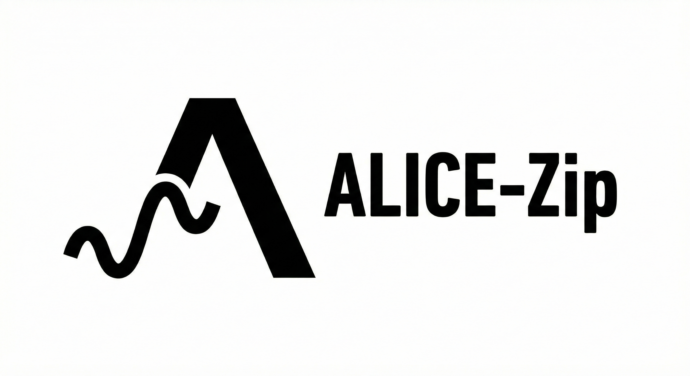

<p align="center">
  
</p>

<h1 align="center">ALICE-Zip</h1>

<p align="center">
  <a href="https://crates.io/crates/alice-zip"></a>
  <a href="https://docs.rs/alice-zip"></a>
  <a href="https://github.com/ext-sakamoro/ALICE-Zip/actions/workflows/ci.yml"></a>
  <a href="https://github.com/ext-sakamoro/ALICE-Zip/actions/workflows/security-audit.yml"></a>
  <a href="https://github.com/ext-sakamoro/ALICE-Zip/actions/workflows/fuzz.yml"></a>
  <a href="#ライセンス"></a>
  <a href="https://python.org"></a>
</p>

> **手続き的生成圧縮エンジン**
> *データではなく、アルゴリズムを保存する。*

[English README](README.md)

---

ALICE-Zipは、データそのものではなく**「データの生成方法」**を保存する次世代圧縮ツールです。

パターン、波形、数学的データに対して**10倍〜1000倍**の圧縮率を実現。
それ以外のデータにはLZMAにフォールバックし、標準ツールより**悪くなることはありません**。

## 特徴

- **手続き的圧縮:** サイン波、多項式、数学的パターンを認識
- **適応型フォールバック:** 手続き的圧縮が効かない場合は自動的にLZMAを選択
- **ロスレス:** ビット完全な復元
- **クロスプラットフォーム:** Python, Rust, C#/Unity, C++/UE5

## リポジトリ構成

| パス | 内容 | 配布先 |
|------|------|--------|
| `/` (`alice-zip`) | **Rust core crate** — 圧縮 primitive (LZ77 / 辞書 / BPE / エントロピー / 量子化 / zlib・LZMA residual container) + 全 generator 法則 (多項式 / Fourier / Perlin)、`no_std + alloc` | [crates.io](https://crates.io/crates/alice-zip) · [docs.rs](https://docs.rs/alice-zip) |
| `libalice/` (`alice-zip-cli`) | CLI `alice`、C FFI (`cdylib`)、PyO3 native module core generators / compression の thin re-export | C# / UE5 binding、pip `libalice` |
| `alice_zip/` | Python package (`ALICEZip` analyzer + `.alice` container) | pip `alice-zip` |
| `bindings/` | C++ / C# (Unity) / UE5 wrapper (`libalice/include/alice.h`) | |

## インストール

```bash
# Python
pip install alice-zip

# Rust
cargo add alice-zip                       # std (default): zlib wrapper 付き
cargo add alice-zip --features fft,parallel,lzma   # rustfft 解析、rayon texture、LZMA residual container
cargo add alice-zip --no-default-features     # no_std + alloc (float は libm)
```

### Rust crate

```rust
use alice_zip::prelude::*;

// 圧縮 primitive (no_std)
let tokens = lz77_encode(b"abcabcabcabc", 256, 32);
assert_eq!(lz77_decode(&tokens)?, b"abcabcabcabc");
assert_eq!(shannon_entropy(&(0..=255u8).collect::<Vec<_>>()), 8.0);

// generator 法則: 系列を fit → 係数だけ保持 → 再生成
let series: Vec<f32> = (0..64).map(|i| 3.0 + 2.0 * i as f32).collect();
let (coeffs, degree, err) = fit_polynomial(&series, 4, 1e-6).unwrap();
assert_eq!((degree, generate_polynomial(64, &coeffs) == series), (1, true));

let (bins, dc) = analyze_signal(&generate_sine_wave(32, 1.0, 2.0, 0.0, 0.5), 4, 0.99);
let regenerated = generate_from_coefficients(32, &bins, dc);
# Ok::<(), alice_zip::ZipError>(())
```

| feature | 追加されるもの | default |
|---------|----------------|---------|
| `std` | `compression` (flate2 zlib)、`ZipError` の `std::error::Error` | ✓ |
| `fft` | `generators::analyze_signal_fft` (rustfft、naive DFT と同一契約) | |
| `parallel` | `generate_perlin_2d` / `_advanced` の rayon 行並列 | |
| `lzma` | `compression::{lzma_compress, lzma_decompress}` + `.alice` の量子化 / lossless residual container (lzma-rs) | |
| *(なし)* | `no_std + alloc`、float は `libm`、CI が `thumbv7em-none-eabihf` で rlib build | |

永続化されている係数 convention は 2 つあり、別名で共存する (別の法則なので暗黙に
混用できない): `fit_polynomial` / `generate_polynomial` (`x = 0..n-1`、昇順 —
`alice-db` segment) と `fit_polynomial_unit` / `generate_polynomial_unit`
(`x ∈ [0, 1]`、降順 — `.alice` container) 全法則は閉形式解との突合
([`tests/analytic_oracle.rs`](tests/analytic_oracle.rs)) と fuzz (7 target、
naive DFT ↔ FFT parity 含む) で検証 MSRV 1.87

## クイックスタート

### コマンドライン

```bash
# 圧縮
alice-zip compress data.bin -o data.alice

# 解凍
alice-zip decompress data.alice -o restored.bin

# ファイル情報を表示
alice-zip info data.alice
```

### Python API

```python
from alice_zip import ALICEZip
import numpy as np

zipper = ALICEZip()

# サイン波データを圧縮
data = np.sin(np.linspace(0, 100*np.pi, 100000)).astype(np.float32)
compressed = zipper.compress(data)

print(f"元サイズ: {data.nbytes:,} bytes")
print(f"圧縮後: {len(compressed):,} bytes")
print(f"圧縮率: {data.nbytes / len(compressed):.1f}x")

# 解凍
restored = zipper.decompress(compressed)
```

## 仕組み

従来の圧縮は**バイト列**のパターンを探します。ALICEは**数学的**パターンを探します。

```
元データ = 生成関数(パラメータ) + 残差

ここで:
  - 生成関数() = 数学関数（多項式、サイン波など）
  - パラメータ = 小さな記述（〜100バイト）
  - 残差 = 圧縮された差分（多くの場合ほぼゼロ）
```

### 例

```
入力:  サイン波、100,000サンプル (400 KB)
        ↓
分析: 「サイン波、周波数=50Hz、振幅=1.0」として検出
        ↓
出力: パラメータのみ (~280バイト)
        ↓
結果: 400 KB → 280バイト = 1400倍圧縮
```

## ベンチマーク

| データタイプ | 元サイズ | 圧縮後 | 圧縮率 |
|-------------|---------|--------|-------|
| サイン波 (100Kサンプル) | 400 KB | 〜280バイト | **1400倍** |
| 多項式 (3次) | 400 KB | 〜285バイト | **1400倍** |
| 線形グラデーション | 400 KB | 〜250バイト | **1600倍** |
| ランダムデータ | 400 KB | 〜370 KB | 1.08倍 (LZMAフォールバック) |

## 最適なユースケース

- **科学データ:** シミュレーション出力、センサー読み取り、波形
- **ゲームアセット:** 手続き的テクスチャ、地形ハイトマップ
- **IoT/エッジ:** 帯域制限のあるデバイスのセンサーログ
- **時系列:** テレメトリ、パターンのある監視ログ

## 使うべきでない場面

| データタイプ | 理由 |
|-------------|------|
| JPEG/PNG/MP3 | 既に圧縮済み |
| ランダム/暗号化データ | パターンがない |
| 小さなファイル (<1KB) | ヘッダーのオーバーヘッド |

## ソースからビルド

```bash
git clone https://github.com/ext-sakamoro/ALICE-Zip
cd ALICE-Zip

# Pythonパッケージをインストール
pip install -e .

# テスト実行
pytest tests/ -v

# Rust core crate — CI の全 gate を local で再現 (scripts/preflight.sh --quick ≈ 3 分)
scripts/preflight.sh

# CLI / FFI crate
cargo build --manifest-path libalice/Cargo.toml --release
```

## ライセンス

- Rust core crate `alice-zip` (`/`): [MIT](LICENSE-MIT) OR [Apache-2.0](LICENSE-APACHE) (選択可)
- CLI / FFI crate (`libalice/`)、Python package (`alice_zip/`)、bindings: [MIT](LICENSE-MIT)
- `libalice-enterprise/`: 別建ての非公開 proprietary crate (同 dir の [LICENSE](libalice-enterprise/LICENSE) 参照)

## 作者

**坂本師哉** (Moroya Sakamoto)

---

*「最良の圧縮とは、データを保存することではなく、それを生成するレシピを保存することである。」*
